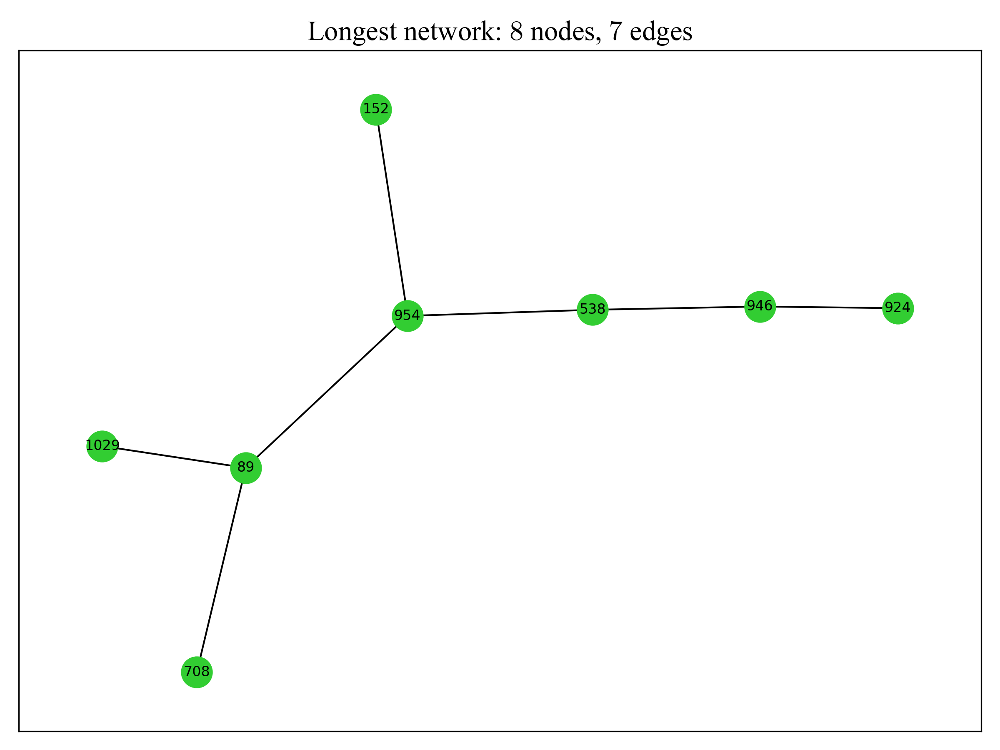

# Report 1
## :white_check_mark: Task(s) Accomplished 
- Managed to draw whole network using data from `e-coupling_with_nn_distance.txt`.
- Successfully assigned attributes  `extracted_value` and `Distance_nm` to every edge within network.
- Found the longest network (largest component).

## :mag: Observations / Findings
- **Whole** network consisted of $1237$ nodes and $809$ edges.
- **Longest** network consisted of $8$ nodes and $7$ edges.
- From the figure below, the whole network is made of many **disjoint subgraphs**.

  

## :space_invader: Code

### Part 1: Whole network of molecules

- Dependencies
- Extract data using `pandas`
- Create graph using `networkx`.

- Set `attributes` to all edges.

- Plotting figure with `matplotlib.pyplot`.

  

### Part 2: Longest network of molecules

- `nx.connected_components` returns a generator object with **all connected components** (disjoint subgraphs). This returns **nodes** of the longest network.
- If *converted into list*, returns `[{707, 39, 1000, 1448, 721, 698, 987}, {1080, 1001}...]`. However, **NOT memory efficient**.
- `max()` method is called which **efficiently** returns the longest *set* within the generator.
- Then, used `query()` method to select corresponding `Mol_j_nearest` within molecules `DataFrame`.
- ` @e` is a `pandas` exclusive *special syntax* that look up the variable named `e` in the local or global namespace of the Python environment.

  

### Part 3: Needle in a haystack

- To identify (color) the longest network within the whole network, must give `nx.draw_networkx()` an argument of `node_color=<list>`.
- Use **list comprehension** on Graph `G` to create a *list of colours* corresponding to their *respective node*.
- For example, `[node1, node2, node3]` is paired with `[steelblue, limegreen, steelblue]`.

  

