# Report 2
## :speech_balloon: Introduction
The task given this week was to create a 3D-graph with "***center of molecule" as the node and distance to its neighbouring molecules as the edges

***center of molecule is defined as the midpoint between both oxygen atoms in the molecule

The tricky part is:
- Molecules may block each other, in which edges does not exist between all molecules
- Atoms are "cut off" at the edges, in which atoms within the same molecule might appear on opposite sides of the unit cell. This requires "reconstruction" of an adjacent unit cell to correctly interpret the distance between the atoms

After many discussions we started with the idea to solve the blocking issue by the following algorithm:
- Draw a line between two selected nodes
- Around all nodes, we define a "hitbox" by draw a circle of radius r(an assumption made to represent the size of the molecule)
- Other than the two selected nodes, the shortest distance between a line and an arbitrary node is found(call it d), repeating for all nodes surrounding the pair of nodes
- If this shortest distance, d is shorter than r, then the line intersects a hitbox and thus the pair is blocked.

  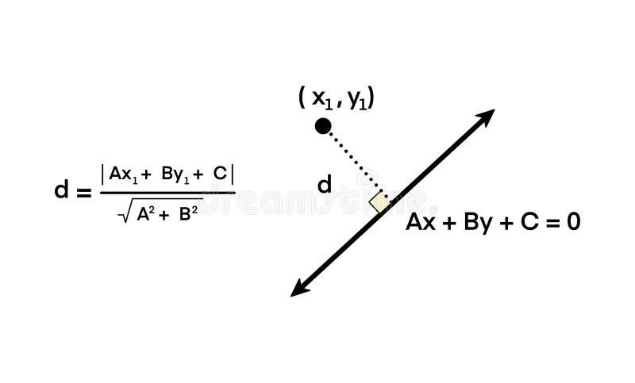
   The above illustrates the shortest distance between a line and a point

The problem with this algorithm would be the amount of computation it requires, and thus we decide to first divide the unit cell into subboxes such that each subboxes houses 0-2 molecules, in which molecules within the subbox as well as within all the adjacent subboxes are deemed nearby to each other and thus computation number would be greatly reduced.

We also had another idea, in which we applied angles. 
- Assuming a 360 degree vision on one node
- All adjacent nodes have a "wingspan" on it which would be blocking vision.
- Iterating from nearest molecule slowly outwards, we would eliminate angles a sector at a time until eventually all angles are accounted for and the molecule cannot "see" other molecules.

  

The goal this week was thus to the first iteration of our idea done:
- **Find the midpoints**
- **Create the subboxes**
- **Define the edges**
- **Try blocking algorithms**
- **Find solutions to periodic boundary condition problem**

## :white_check_mark: Task(s) Accomplished 
<b>

1. Made data extracting algorithm

2. Found midpoint between oxygen molecules of each molecule and defined it as a node

3. Divided the whole unit cell into subboxes

4. Made edges between molecules that are defined "nearby"

5. Found solution to periodic boundary condition problem

6. Made algorithm to find nearest neighbours without blocking using angles 

</b>

## :space_invader: Code

### 1. Made data extracting algorithm 
Multiple data extracting algorithms were implemented, one using pandas is shown:
- Due to the way .gro files are formatted, we can easily extract data based on column number
- After defining the column spacing with their names, using pd.read_fwf() we extract all the data, leaving the title, number of atoms and box dimensions
- To extract the rest, we used python built in function f.readline() twice to read the title and number of atoms.
- Afterwards we use the seek function and a while loop to move the cursor all the way to the start of the line with box dimensions. The whence parameter can be set to 2 so that the calculation starts at the end of the file or 1 so that it starts from the current cursor position.

  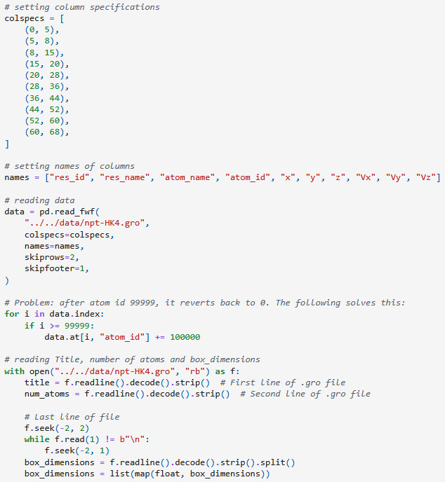

### 2. Found midpoint between oxygen molecules of each molecule and defined it as a node
A few algorithms were also implemented, we'll highlight one here but head to /notebooks/02_graph_network_of_e-coupling_3D/kz_temp/kz.ipynb to check out more
- We start off by extracting the positions of two oxygen atoms in the molecule
- To solve the periodic boundary condition problem here, we first find the difference of xyz coordinates between the atoms, which more or less should be $< |1|$. 
- If the difference is more than 1, that indicates that O1 is bigger than O2, indicating that the position of O1 is larger than O2, and thus we target it to readjust it to a smaller position. We do this by subtracting O1 by the box_dimensions.
- On the flip side, O2 would be subtracted by the box_dimensions instead.
- With this adjusted position, we then are able to find the centre by averaging between the two points

  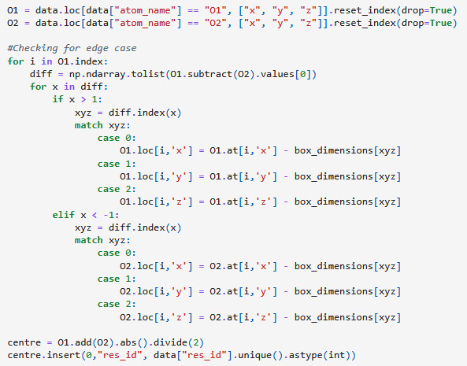

### 3. Divided the whole unit cell into subboxes
A problem arose here, the original idea was to find the dimensions of one molecule and treat it as a box, then by dividing the unit cell by this dimension, we can find the number of boxes we need to divide the unit cell into so that we can get subboxes that have an average number of molecules in it of approximately 1. However this would be wrong as the space is packed so tight that we cannot treat each molecule as a box. The attempt is kept though as a proof of concept as well as possible future usage.  
<u>In the end, we defined the number of subboxes to be 1331, which is the closest cube root to 1501, the number of molecules in the unit cell.</u>

  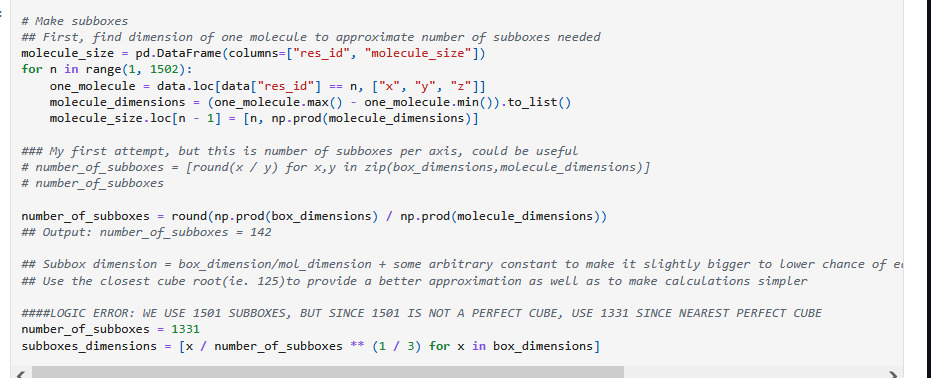

Afterwards, we look to find the number of molecule in each subbox

- We start by first indexing the 3D box, starting from (1,1,1) indicating the box at one corner, up to (11,11,11). We also add a layer surrounding it so we have (0,0,0) to (12,12,12) to account for the periodic boundary condition
- Then for every one of these indices, we extract all the nodes that exist in this subbox by using a for loop, and checking if their coordinates are between the range of the subbox dimension. each indices here would indicate how "far" the box ranges between.
- We store all the molecules' id, x position, y position, z position and keep them indexed by the box indices.

  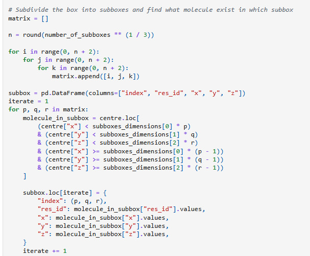

### 4. Made edges between molecules that are defined "nearby"
The edges are then found and they can split into steps:
1. Connect the edges of nodes within a subbox
- After selecting one subbox, we find all the nodes within this subbox. Then if the amount of nodes are more than one, then we generate combinations of these nodes but only in pairs.

  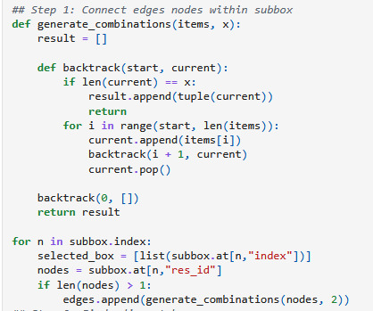

2. Find adjacent boxes
- For every selected box, we ue a nested for loop to find the indices of the boxes in a 3 subbox by 3 subbox cube centered on the selected box. This cube obviously also includes the selected box so we remove it afterwards

  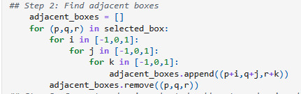

3. Connect nodes in selected subbox to nodes in adjacent subbox
- For every subbox that we have, using its index, we find the nodes in it. Then using a for loop over the all the adjacent nodes, we use a nested for loop to pair the node in the selected subbox to the adjacent nodes and put it in a list edges

  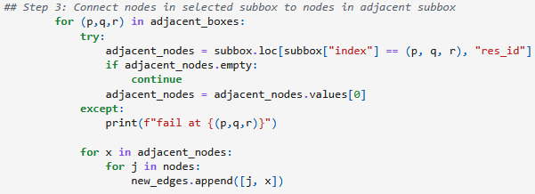

4. Assign weightage to each edge
- Now that we have a list of pairs of nodes, we can simply use a for loop looping through the list of pairs, and finding the xyz coordinates of each node then using the distance formula to find the distance between them. Afterwards we update the pair of nodes to also have its weightage such that the list looks like: [('node1', 'node2', ' weightage12'),('node1', 'node3', ' weightage13), ...]

  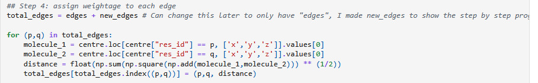

Finally, to better illustrate this, step 1, 3 and 4 were plotted using networkx. Note this does not have any physical meaning, it only serves to illustrate what happens in the code. In step 1, all the nodes can be seen group into groups of 1-3 nodes. In step 2 we have connected edges between nodes. In step 4, the edges now have different lengths depending on distance.

  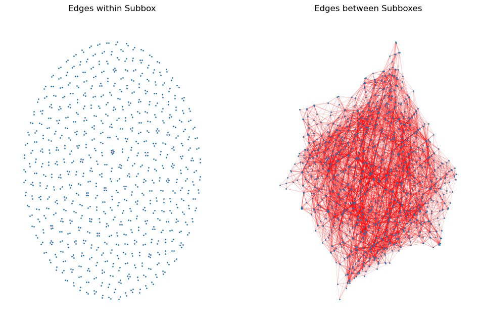

  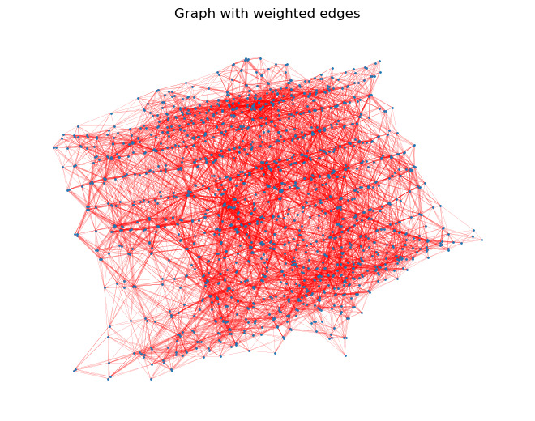

### 5. Found solution to periodic boundary condition problem
The following illustration will be based on the midpoint finding step, but is notable so will be talked about here.
- A standard periodic boundary condition midpoint algorithm was found. It calculates the midpoint of two 3D position vectors using the standard minimum image convention for periodic boundary conditions. This method is generally more robust and physically correct. 
- Using numpy's arrays which allow for simpler use of mathematical operations between arrays of same size, we first find the difference of the coordinates of the two points, p1 and p2
- Then, subtract this diff by the product of the box_dimension, L, with the rounded ratio of the difference to the box_dimension itself, diff/L. This applies the minimum image convention to the difference vector and thus finds the shortest vector connecting p1 to p2, accounting for boundaries.
- We then calculate the midpoint by adding the coordinates of p1 with half of the minimum image vector to the first particle
- We then wrap the final midpoint position back into the box by finding the modulus between the midpoint to the box_dimension, L

  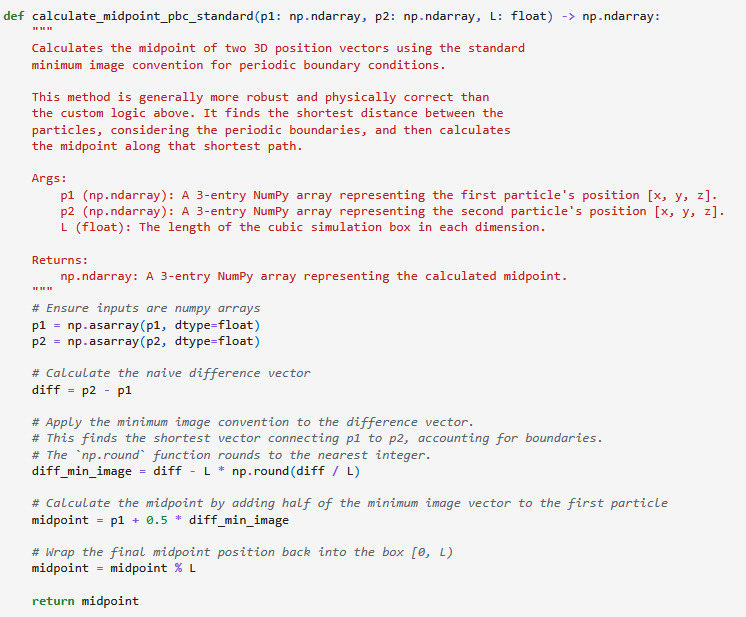

### 6. Made algorithm to find nearest neighbours without blocking using angles
We have a first attempt in finding an algorithm to find where molecules block each other, and it involves angles.
1. We first define functions to:
    1. Find distances from a given node to all other nodes, using the standard distance formula, then sort them ascendingly. Returning the distance and the respective indices of said distance
    2. Find angles from a given node to another point, using the function np.arctan2, which unlike np.arctan ranges between [$-\frac{\pi}{2}$,$\frac{\pi}{2}$], arctan2 ranges between [$-\pi$,$\pi$] radians. It also correctly identifies quadrants of the angle based on the sign of the inputted y and x values.

  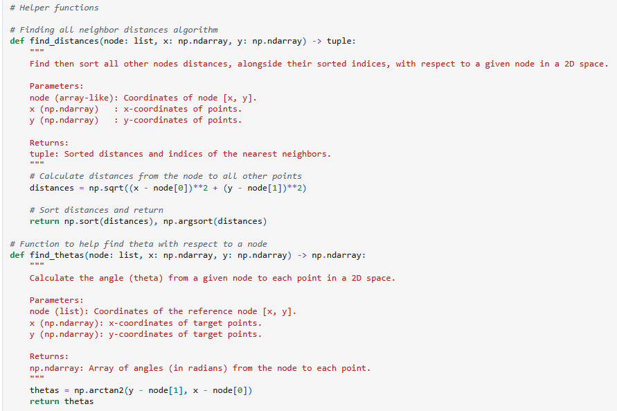

2. Looping through the each of node using a for loop, we first find the distance between the selected node with all other nodes. Then we delete this node as well as its distance from the big database of all the x and y coordinates and distances so that we don't check the blocking with the pair itself. This is done by deleting the first returned index from the above function as since its distance to itself is the shortest and the list is sorted, it itself will always be the first index. We also get the sorted thetas from the above defined function.

  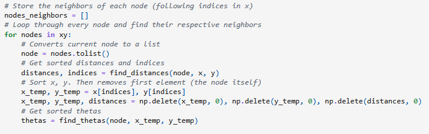

3. Then, we setup a blocking of a node, which we can interpret as the "wingspan" of the node w.r.t the selected node, we define each wing on each side: block_1 and block_2. We find the blocking amount, i.e. how long the "wings" are, which are defined as dx and dy for each coordinate, of each neighbouring nodes using sine and cosine respectively. Then we find the thetas using the above function but this time with the x and y coordinates of block_1, and block_2 respectively. Finally we convert the thetas range to [0, $2\pi$] as well as solve the edge case where thetas might exceed the range of [0, $2\pi$]. The following is an illustration of the concept:

  

  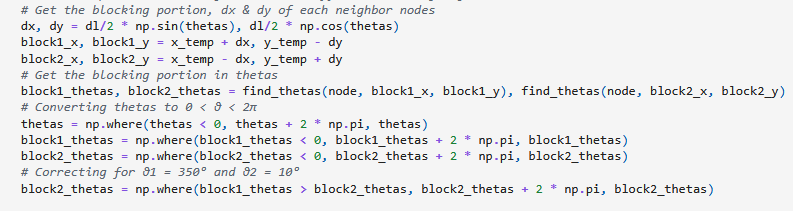

4. Lastly, we use a for loop to iterate over all blocks to find which nodes have been blocked, to do this, we used the np.where function which only selects data given a certain condition. The condition given is as follows:

$$ ((\theta_1  < \theta_2)|(\theta_1 <\theta+2\pi < \theta_2))\ \& \ (d_{node} \ > \ d_{currentnode})$$

$$ where\ d\ is\ distance$$

After applying this filter, we remove all duplicate indices and make append the remaining non-blocked nodes in a list called nodes_neighbours.

  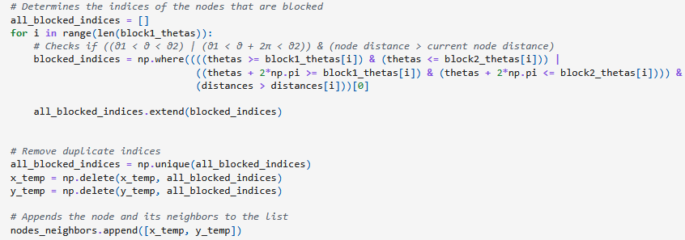

The final plot looks as follows:

  

## :fast_forward: Moving Forward
Moving forward, with our first iteration of the task done, we will look to further improve these programs through bug fixing, as well as combining them with each other to provide one singular coherent program. We look to first:
<b>
1. Continue working on the other nearest neighbour algorithm involving "hitboxes"
2. Working on improvements to the current nearest neighbour algorithm involving angles, expanding from 2D cases to 3D
3. Work on proper 3D plotting
4. Combine the working code into one singular program
5. Bug fix, looking for any discrepencies and problems in our code
</b>