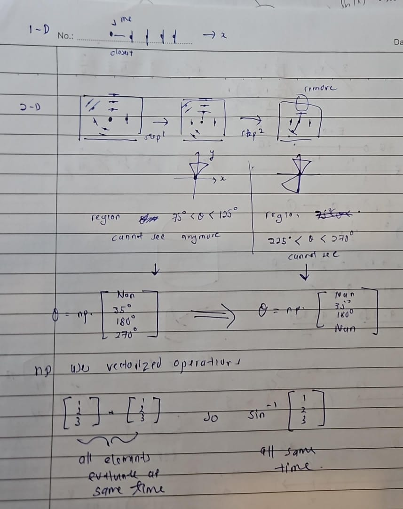
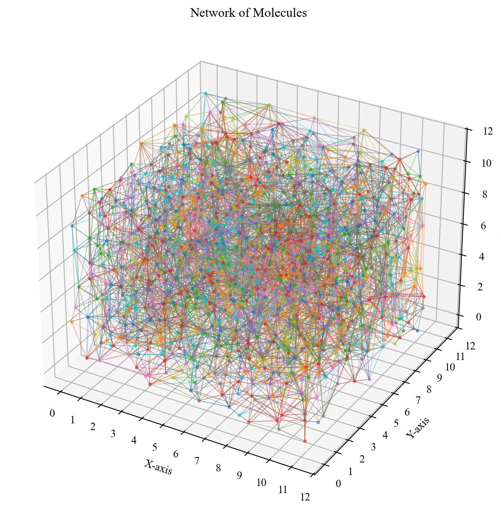
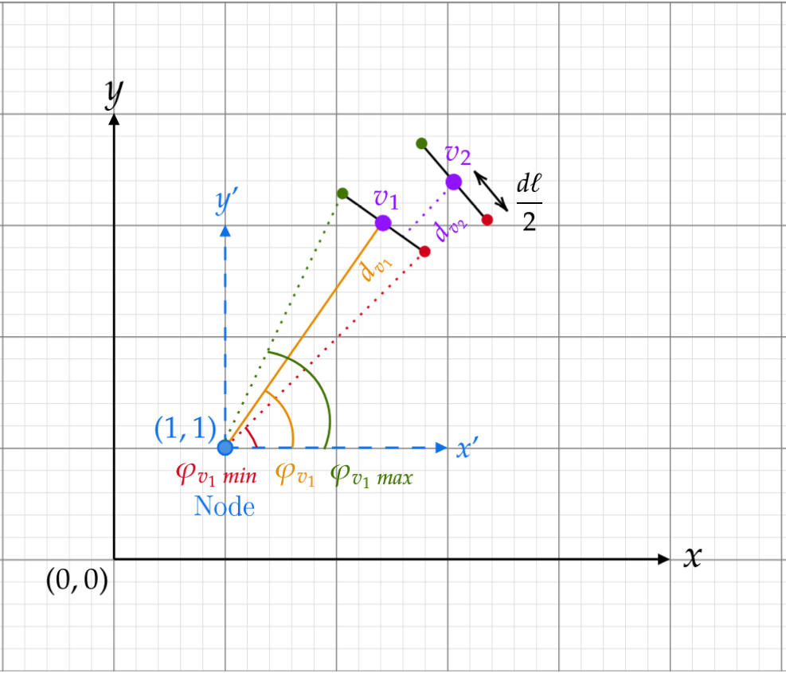
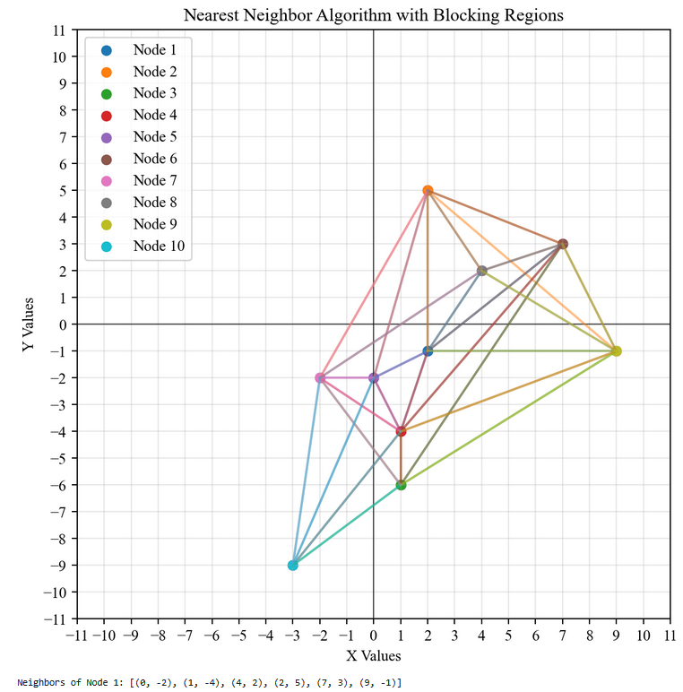
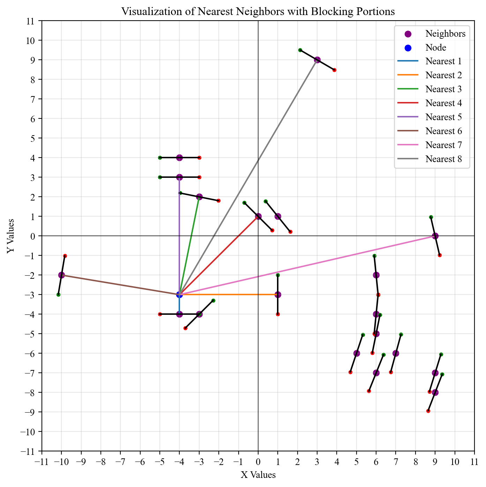
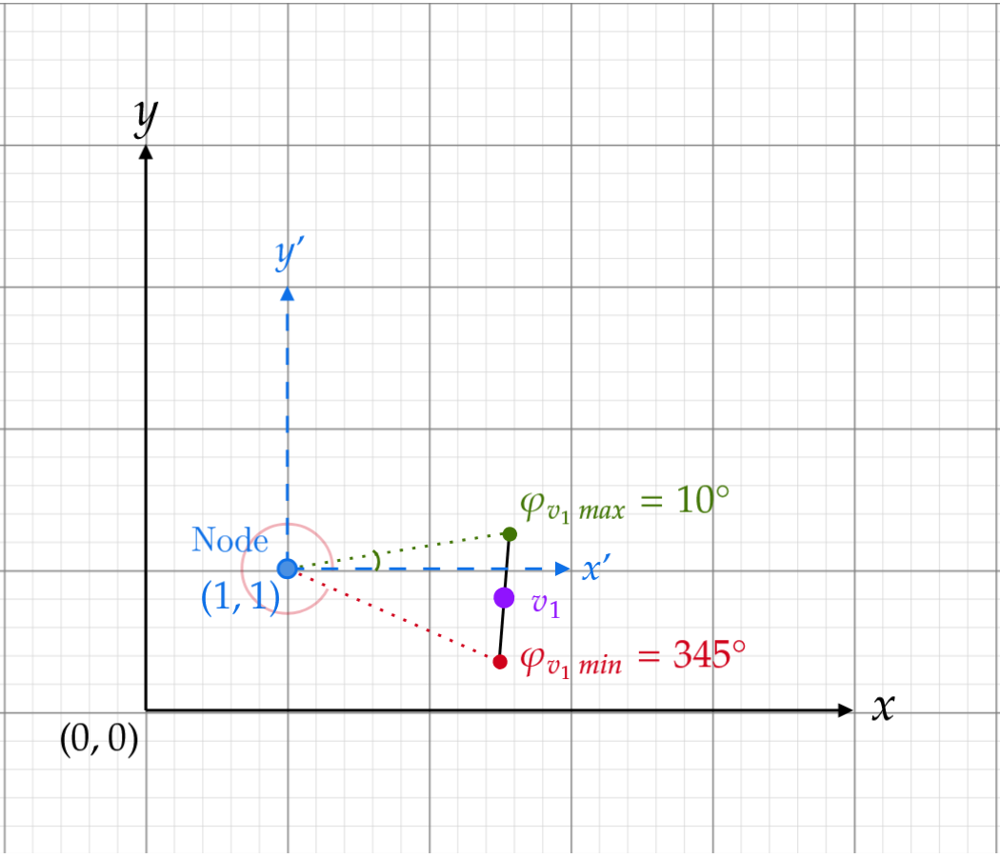
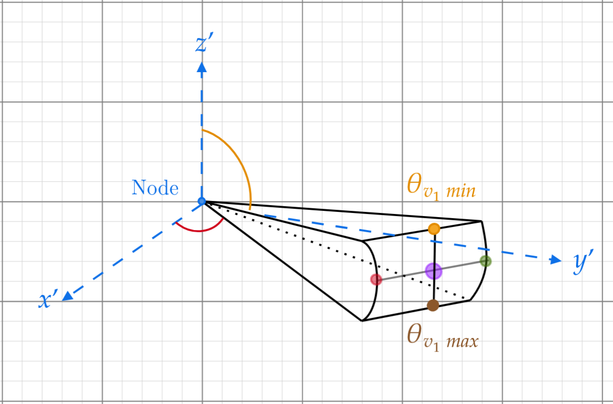
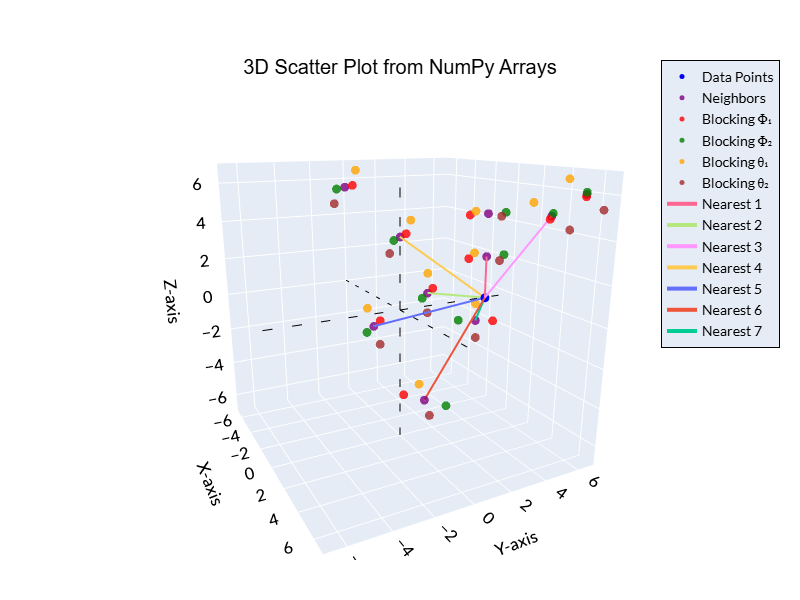
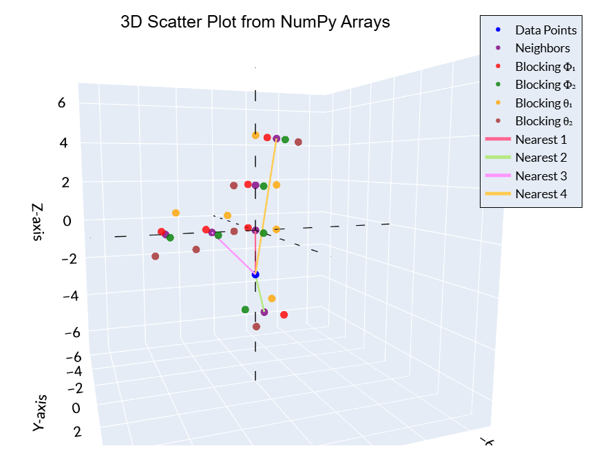

# Report 3
## :speech_balloon: Introduction
Hello
<!-- <div style="text-align: center;">
  
</div> -->

## :dart: Goal

The goal this week was to complete
<b>

- hello

</b>

## :white_check_mark: Task(s) Accomplished 
<b>

1. Testing

</b>

## :balance_scale: Comparison(s) between Methods

| Criteria | :package: **Sub-box** | :triangular_ruler: **Angles** |
|:---|:---|:---|
| **Primary Use** | General-purpose programming, Machine Learning | Statistical analysis, Data visualization |
| **Learning Curve** | Often considered easier for beginners | Can be steeper due to specialized syntax |
| **Ecosystem** | Vast and versatile (TensorFlow, PyTorch, etc.) | Strong focus on statistics (ggplot2, tidyr, etc.) |
| **Community** | Large, general-purpose programming community | Large, statistics-focused community |

## :package: Method 1: Sub-box
Hello

### :space_invader: Code

```python
print("Hello dunia")
```

## :triangular_ruler: Method 2: Angles

### :bar_chart: Results & Observation 

Overall, since the *total number of edges* obtained in both Method 1 and Method 2 are *similar*, we can say that these two methods were a success.

Although, it cannot be ignored that the *total number of edges* obtained by Method 2 is in-fact **greater** than *Method 1*. This is likely due to the code error mentioned in the [3-D Section](#warning-blocking-model-bug-1) below. 

Actually, Method 2 was initially considered as a *'guaranteed'* method of obtaining an accurate *total number of edges*, and thus used to measure the effectiveness of Method 1. However, taking into account the *extra edges* produced by Method 2 due to coding error, we hypothesize that **Method 1** is the **more accurate** and **reliable** model.

Another **disadvantage** of the Method 2 is the difficulty to implement it into code, especially when extending to higher-dimensions. *Dealing with angles* required a lot of *'clunky'* code to implement, and also produced an *error that was unable to solved*.

```
Total number of nodes: 1501
Total number of edges: 15325
Average number of edges per node: 10.21

Neighbors of Node 1: [('1.3', '0.6675', '10.66'), ('2.188', '0.223', '11'), ('1.774', '0.28', '10.28')]
```
<p align="center">
    
</p>
<p align="center">Illustration of 3-D network of molecules with blocking</p>

---

### **Two-Dimensions**

Before tackling 3-D case, we consider 2-D case as it is much simpler.

#### :thought_balloon: Concept
- In 2-D space, any point can be described in polar coordinates by the basis $(r,\varphi).$
- Every node $v$ has a diameter, $d\ell$ which can **block** connection from one node to another. The region that is blocked we call as ***wingspan*** as shown in the diagram below.
- A node $v_2$ is considered **blocked** by another node $v_1$ if *both the following conditions are met*:
    1. $v_2$ lies further away from $v_1;$ $(r_{v_2}>r_{v_3})$
    2. $v_2$ lies within the wingspan of $v_1;$ $(\varphi_{v_1\, \text{min}}\leq\varphi_{v_2}\leq\varphi_{v_1\, \text{max}}).$

<p align="center">
    
</p>
<p align="center">Illustration of node 2 being blocked by node 1, from the reference frame of selected node</p>

- Therefore, the idea is to loop through every single node $v_i$ and determine from that node's reference frame, which neighboring nodes are blocked. 
- Once the loop has ended, we successfully obtained all possible neighbors for every individual node $v_i$ as shown in the figure below.

<p align="center">
    
</p>
<p align="center">Successful 2D network graph</p>

#### :lock: Blocking Model
- Assume that every node $v$ has wingspan $d\ell$.
- Value $d\ell$ was pre-calculated and found to be $1.6\mathrm{nm}.$
- Each node $v$ *sees the full wingspan* of neighboring nodes as the figure below. (in other words, every node is effectively a 'spherical' molecule)

<p align="center">
    
</p>
<p align="center">Successful implementation of blocking model on a single node</p>

#### :warning: Blocking model bug

- However, there is a bug in this implementation that must be taken into account. It is shown in the figure below.
- This problem was solved by simply checking if $\varphi_{v_1 \,\text{max}} < \varphi_{v_1 \,\text{min}}$, then if `True` adding $2\pi$ to $\varphi_{v_1\,\text{max}}$. Finally, adding another check whether $\varphi_{v_1\,\text{min}}\leq\varphi_{v_i}+2\pi\leq\varphi_{v_2\,\text{max}}$.

<p align="center">
    
</p>
<p align="center">Bug in angle implementation</p>


#### :space_invader: Code

In order to reduce computation time, **numpy vectorised calculations** were used. In simple terms, if two numpy arrays $A$ and $B$ both contains 100 elements, and an operation is carried out between them such as `+`, `-`, `*` or `/`, **all elements are evaluated in parallel** (at the same time). This is much quicker compared Python's slower `for` loops. Furthermore, [boolean masking](https://how.dev/answers/what-is-boolean-masking-on-numpy-arrays-in-python) is also used to speed up checking.

**Variables:**
- `distances` — numpy array storing $r_v$ for all neighboring nodes, **with respect** to selected node $v_i$.
- `phis` — numpy array storing angles $\varphi$ of all neighboring nodes, **with respect** to selected node $v_i$.
- `block1_phis` — numpy array storing $\varphi_{v\,\text{min}}$ for all neighboring nodes, **with respect** to selected node $v_i$.
- `block2_phis` — numpy array storing $\varphi_{v\,\text{max}}$ for all neighboring nodes, **with respect** to selected node $v_i$.
- `nodes_neighbors = []` — list that stores all neighboring nodes to a selected node $v_i$.

**Pre-Processing:**
- Initially, for each selected node $v_i$, all of it's neighbors distances $d$ with respect to it, are **sorted ascending order** (closest to furthest). These values are stored in `distances`.
- The same arrangement is used on `phis`, `block1_phis` and `block2_phis` so that they are all **consistent** with each other. (i.e. closest to furthest)

**Blocking algorithm:**

- First, this algorithm loops through **every single neighboring node's wingspan**, that is `block1_phis[i]` and `block2_phis[i]`. For example, let's say we are currently checking the first neighbor node, $v_1$.
- Second, it checks whether any `phis` (angle of neighbor nodes with respect to selected node $v_i$) are **blocked by** $\varphi_{v_1\,\text{min}}$ and $\varphi_{v_1\,\text{max}}$.
- Third, it checks whether `distances > distances[i]`, meaning if the neighbor nodes say $v_2$ and $v_3$ are located **further** compared to $v_1$.
- Fourth, if these 2 conditions are met (for example neighbor $v_2$ is blocked by neighbor $v_1$), the indices of the blocked neighbor will be stored in `all_blocked_indices`.
- Fifth, this is repeated for all neighboring nodes with respect to a selected node $v_1$, and once the loop ends, we get all blocked neighbors indices. Duplicate indices are removed.
- Sixth, neighbors that are **not blocked**, are appended into `nodes_neighbors`.
- The above six steps are repeated for every single node $v_i$. Hence, each element within `nodes_neighbors` is a list of **not blocked** neighbors. (i.e. `nodes_neighbors[2]` is a list containing all not blocked neighbors of node $v_3$).


```python
# Loop through every node and find their respective neighbors
nodes_neighbors = []
for nodes in xyz:

    # --------------------------------------
    # Pre-processing
    # --------------------------------------
    
    # --------------------------------------
    # Blocking Algorithm
    # --------------------------------------

    # Appends a list all coordinates (x,y,z) of all non-blocked neighbors of the current selected node
    nodes_neighbors.append(list(zip(x_temp, y_temp, z_temp)))
```

```python
# --------------------------------------
# Blocking Algorithm
# --------------------------------------

# Determines the indices of the nodes that are blocked
all_blocked_indices = []
for i in range(len(block1_phis)):
    # Checks if ((Φ1 < Φ < Φ2) | (Φ1 < Φ + 2π < Φ2)) & (node distance > current node distance)
    blocked_indices = np.where((((phis >= block1_phis[i]) & (phis <= block2_phis[i])) |
                        ((phis + 2*np.pi >= block1_phis[i]) & (phis + 2*np.pi <= block2_phis[i]))) &
                        (distances > distances[i]))[0]

    all_blocked_indices.extend(blocked_indices)


# Remove duplicate indices
all_blocked_indices = np.unique(all_blocked_indices)
try:
    x_temp = np.delete(x_temp, all_blocked_indices)
    y_temp = np.delete(y_temp, all_blocked_indices)
except IndexError:
    # Fix problem: all_blocked_indices is empty ndarray
    pass
```

---

### **Three-Dimensions**

Take note that 3-D case has a code error that is difficult has not been fixed.

#### :thought_balloon: Concept
- In 3-D space, any point can be described in spherical coordinates by the basis $(r,\varphi,\theta).$
- A node $v_2$ is considered **blocked** by another node $v_1$ if *all 3 of the following conditions are met*:
    1. $v_2$ lies further away from $v_1;$ $(r_{v_2}>r_{v_3})$
    2. $v_2$ lies within the azimuthal wingspan of $v_1;$ $(\varphi_{v_1\, \text{min}}\leq\varphi_{v_2}\leq\varphi_{v_1\, \text{max}})$
    3. $v_2$ lies within the zenith wingspan of $v_1;$ $(\theta_{v_1\, \text{min}}\leq\theta_{v_2}\leq\theta_{v_1\, \text{max}})$

<p align="center">
    
</p>  
<p align="center">Illustration of the blocking surface of node 1</p>

- The idea is the same as discussed in the 2-D case.

#### :lock: Blocking Model
- Assume that every node $v$ has wingspan $d\ell$.
- Value $d\ell$ was pre-calculated and found to be $1.6\mathrm{nm}.$
- Each node $v$ *sees a square area* $(d\ell\times d\ell)$ as shown the figure below. (in other words, every node is effectively a 'cube' molecule)

<p align="center">
    
</p>  
<p align="center">Semi-successful implementation of blocking model on a single node</p>

#### :warning: Blocking model bug
- At angles nearing $\theta\to0\degree$ and $\theta\to180\degree$, a bug as shown in the diagram below will occur.
- This is because the square blocking area is **within the four-quadrants**. This messes up the code for the blocking detection in $\varphi$ (rather it is $\varphi$ algorithm that does not take this into account).
- For example, in the diagram below, the node is at $\theta\approx 10\degree$. But we can clearly see that the square area encompasses $0\degree\leq\varphi<360\degree$.
- However, the value of $\varphi_{v\,\text{min}}=270\degree$ while $\varphi_{v\,\text{max}}=450\degree$. This is a difference of only $180\degree$ which is the cause of this issue.
- The diagram below shows the node being in $0\degree\leq\varphi\leq180\degree,$ and therefore **an edge is drawn between them** **despite being blocked**.
- Unfortunately, for now am **unable** to think of a solution to this problem. So it remains in this version of code.

<p align="center">
    
</p>
<p align="center">Bug in 3-D  blocking model</p>

#### :space_invader: Code

- Since the code is similar to that of 2-D case, can infer that it works roughly the same way.

```python
# --------------------------------------
# Blocking Algorithm
# --------------------------------------
# Note that this algorithm is INCOMPLETE, that is PRODUCES ERRORS near θ ≈ 0° and θ ≈ 180° (3-D)
# However, Φ works perfectly (2-D)

# Determines the indices of the neighbors that are blocked
all_blocked_indices = []
for i in range(len(block1_phis)):
    # Checks for the conditions:
    # 1. ((Φ1 < Φ < Φ2) | (Φ1 < Φ + 2π < Φ2)) &
    # 2. (θ1 < θ < θ2) &
    # 3. (neighbor distance > current neighbor distance)
    blocked_indices = np.where(
        (((phis >= block1_phis[i]) & (phis <= block2_phis[i])) | ((phis + 2*np.pi >= block1_phis[i])
         & (phis + 2*np.pi <= block2_phis[i]))) &
        ((thetas >= block1_thetas[i]) & (thetas <= block2_thetas[i])) &
        (distances > distances[i])
        )[0]
    
    all_blocked_indices.extend(blocked_indices)
        
# Remove duplicate indices
all_blocked_indices = np.unique(all_blocked_indices)
try:
    x_temp = np.delete(x_temp, all_blocked_indices)
    y_temp = np.delete(y_temp, all_blocked_indices)
    z_temp = np.delete(z_temp, all_blocked_indices)
except IndexError:
    # Fix problem: all_blocked_indices is empty ndarray
    pass
```